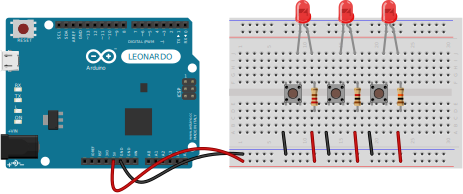

# Exercise 01 - LED Basics

This exercise will show how to use an Arduino as a powers source for simple LED appliances.

## Required Parts

* Arduino Leonardo or any 5 volt source
* Breadboard
* 8x Jumper wires
* Resistor 220 Ω
* Resistor 1 kΩ
* Resistor 10 kΩ
* 3x Tact switch
* 3x 5mm LED Red
* Potentiometer 10 kΩ

## Part 1

In this section it will be presented how resistance value can affect the bright strength of LED. For this scenario different values of resistors will be used:

* 220 Ω
* 1 kΩ
* 10 kΩ

Simple wiring uses Arduino **+5V** output pin as a power source for LED and **GND** pin for common ground.

As it was expected due to *[Ohm's law](https://en.wikipedia.org/wiki/Ohm%27s_law)* higher resistor value causes higher voltage drop and LED emits more dimmed light.

## Part 2

This section extends previous example by providing a little bit of manual control which LED needs to be on. For that simple switches will be added to the circuit.

With this Approach LED will emit light only when proper button is pressed.

## Part 3

Third part is focused on using Rotary potentiometer to dynamically adjust LED dimming effect. For this a 10k rotary potentiometer will be used.

By creating this simple circuit on a breadboard and then rotating the potentiometer it can be seen how LED changes it brightness.

