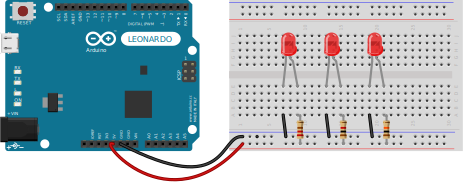

# Exercise 01 - LED Basics

This exercise will show how to use an Arduino as a powers source for simple LED appliances.

## Part 1

In this section it will be presented how resistance value can affect the brightenece of LED. For this senarion different values of resistors will be used:

* 220 Ω
* 1 kΩ
* 10 kΩ

Simple wireing uses Arduino **+5V** output pin as a power source for LED and **GND** pin for common ground.

As it was expected due to *Ohm law* higher resistor value causes higher voltage drop and LED emits more dimmed light.
